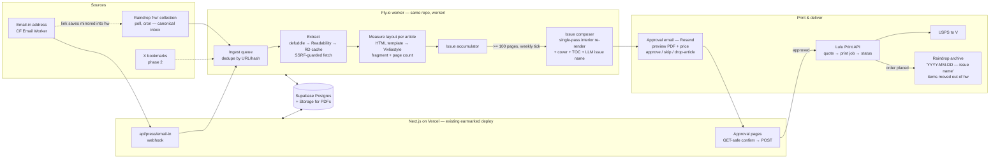

# feat: press — saved reading → printed magazine pipeline

**Target repo:** `vagarwalla/earmarked` (per V, 2026-08-27: lives here and inherits this repo's scaffolding — Next.js App Router on Vercel, Supabase Postgres via `supabase/migrations/`, Tailwind + shadcn/ui, vitest). Internal module namespace: **`press`** (`src/lib/press/`, `src/app/api/press/`); the earlier standalone working name "tearsheet" is retired. The printed magazine's masthead is a separate naming decision (see Open Questions).

---

## Summary

A personal pipeline inside Earmarked that collects everything V saves online — Substack newsletters, Twitter/X bookmarks, Raindrop links, ad-hoc dropped links, occasional PDFs — extracts clean article text and images, lays each piece out as minimalist magazine pages (Nat Geo-ish: real typography, generous images, captions), and accumulates them into an issue. When the issue crosses ~100 pages, it renders a print-ready PDF (interior + cover), sends V a preview + approval email, and on approval orders a single copy through the **Lulu Print API**, mailed to her address.

**Raindrop is the system of record throughout:** everything in the pipeline lives in V's existing `hw` / `homework` Raindrop collection while an issue is filling; when an issue is printed, its articles move to a fresh Raindrop collection named after the issue (`YYYY-MM-DD — <issue name>`), so Raindrop mirrors the shelf of printed issues.

This is a self-hosted, multi-source version of [Offprint](https://getoffprint.com/) ($29/mo, monthly, SMS-only ingestion). **Research finding: Offprint's own stack, per their privacy policy, is Twilio (SMS), Stripe (payments), Lulu (printing & shipping), Anthropic (message processing), Resend (email), Fly.io (hosting)** — i.e. the exact print path this plan proposes is the one already proven in production by the service V pointed at.

---

## Problem Frame

V saves more than she reads, across scattered surfaces (Substack inbox, X bookmarks, Raindrop, random tabs). Screens are a bad place to catch up on long-form. The fix is format-shifting: a recurring, physically mailed magazine of her own saved reading — automatic enough that it requires no curation effort, nice enough (layout, paper, images) that it's a pleasure object, not a printout.

**Success criteria**

- Dropping a link anywhere (Raindrop share sheet, email-in address, forwarded newsletter) lands it in the pipeline with zero extra steps — and shows up in the `hw` Raindrop collection, the single visible "what's in the next issue" surface.
- Substack newsletters — including paid ones — arrive with full text and images.
- Generated pages look like a designed magazine: multi-column where it suits, hyphenated/justified text, images with captions, per-article title pages, TOC, cover.
- When an issue crosses ~100 pages, V gets a preview PDF and a one-tap approve (with per-article drop links); approved issues arrive at her door with no further action.
- Per-issue cost is known before ordering (Lulu price quote surfaced in the approval email).
- A printed issue's articles leave `hw` and land in a dated, named Raindrop collection — the archive builds itself.

---

## Assumptions

Made without a synchronous user to ask; each is cheap to reverse. Flag any that are wrong.

1. **Trigger reconciliation.** "Weekly" + "when it hits 100 pages" is read as: the pipeline checks weekly, and an issue closes when it has ≥100 laid-out pages — so cadence is actually "whenever reading volume fills an issue," checked on a weekly tick. (Lulu perfect-bound needs ≥32 pages; Offprint's own floor is 96 pages, which corroborates ~100 as a sane issue size.) A max-age backstop (default 8 weeks, if the issue clears Lulu's 32-page floor) force-closes a slow issue so the loop never silently stalls.
2. **Approval before ordering — manual only in v1.** Printing costs real money and a botched render would waste an issue. V1 ships only the one-tap approval email (mirroring Offprint's human-review step); a fully automatic mode is follow-up work if the tap ever gets annoying, not a v1 config path.
3. **TypeScript end-to-end** — the repo's language. Extraction uses the JS ecosystem (Mozilla Readability + defuddle), PDF assembly uses `pdf-lib`, rendering uses Vivliostyle CLI (Node). The earlier standalone draft assumed Python (trafilatura/WeasyPrint); re-based per V's scaffolding instruction, and the JS equivalents are first-rate (see KTD2/KTD3).
4. **Raindrop `hw` collection is the canonical inbox** (per V, 2026-08-27 — the collection already exists as `hw` or `homework`; resolve the exact slug at setup by listing collections and matching either name). The email-in address is the second door (newsletters, PDFs, mail-a-link); links arriving by email are mirrored *into* `hw` so Raindrop stays the one true list. Substack newsletters and PDF attachments are app-side items only (no meaningful raindrop to create; revisit if V wants them visible — Open Question 5).
5. **X bookmarks are phase 2.** The X API has no free tier; owned-reads are cheap (~$0.001/read) but need a paid developer account + OAuth setup. V1 path: bookmark → share to Raindrop (two taps), or periodic Dewey/Twillot export. Direct API sync is a follow-up unit.
6. **Split runtime, one repo.** Webhooks and approval pages are Next.js API routes/pages on the existing Vercel deploy; state is the existing Supabase Postgres (new tables via the repo's migration chain); the heavy work — scheduled polling, Chromium-based rendering, compose, ordering — runs in a small always-on **Fly.io worker** built from this repo (`worker/`), because headless Chromium + multi-minute 100-page renders don't fit Vercel function limits. Fly is already the personal-infra pattern (`vagarwalla/books` canonical; registry row added on deploy).
7. **Public repo caution.** `earmarked` is public: no addresses, tokens, or personal data in code or docs — secrets live in Vercel/Fly env and Supabase. The plan itself contains none.

---

## Key Technical Decisions

| # | Decision | Rationale |
|---|---|---|
| KTD1 | **Print via Lulu Print API — 7×10 "Executive" trim, perfect bound, standard color on 80# coated, glossy cover** | Confirmed as Offprint's actual print partner (their privacy policy). Independently top-ranked in research: free self-serve API, OAuth2 client-credentials, true qty=1, real sandbox (`api.sandbox.lulu.com`), price-calculation endpoint, webhooks. **Live calculator (2026-08-27): trim size does not affect price — 100 pp perfect-bound 80#-coated glossy costs $8.51 in Standard Color and $23.64 in Premium Color at both 8.5×11 and 7×10.** Per V's "whichever is cheaper": print price ties, so 7×10 wins on the secondary axes — lighter (cheaper/equal shipping), and closer to Nat Geo's actual trim (~6.9×10). Observed calculator package id for this spec: `0700X1000.FC.STD.PB.080CW444.GXX` (verify against the API's package list at U6). Start on Standard Color ($8.51); the U0 pilot decides whether photo quality forces Premium ($23.64) — color tier, not trim, is the real cost lever. Fallbacks if quality disappoints: Bookvault, Peecho. |
| KTD2 | **Layout = HTML/CSS Paged Media rendered by Vivliostyle CLI (Node, Chromium engine)** | Node-native fit for this repo, ships an actual magazine template as a starting point, CMYK-capable, and renders with a real browser engine — full modern CSS including `column-span: all`, proper hyphenation/justification, page counters, running headers. Templates stay plain HTML+CSS (CSS Paged Media), so the renderer stays swappable (WeasyPrint/Paged.js consume the same input). Rejected: WeasyPrint (Python, and no `column-span`), Typst (no HTML import, weak widow/orphan control), Prince ($3,800), react-pdf (line-level-only orphan control). Runs in the Fly worker (assumption 6) — Chromium doesn't fit Vercel functions. |
| KTD3 | **Extraction = defuddle + Mozilla Readability, Raindrop permanent-copy cache as third resort** | JS-native ladder: defuddle (Obsidian Web Clipper's extractor — multi-pass, strong on messy pages) with Readability as the conservative cross-check/fallback; Raindrop Pro ($3/mo) stores a server-side full-page permanent copy retrievable via `GET /raindrop/{id}/cache` — a zero-effort fallback for hostile pages. (Note: Raindrop deletes permanent copies ~1 month after a Pro subscription lapses.) Trafilatura (best-benchmarked overall) is Python-only; not worth a second runtime. |
| KTD4 | **Substack via email, not RSS/scraping — per-sender allowlist** | Substack has no public API and paywalls paid-post bodies in RSS. The delivered email contains full HTML for anything V subscribes to — so an email-in address (+ Gmail auto-forward) is the only reliable full-text path, and it doubles as the PDF-upload and mail-a-link door. The Gmail filter forwards an **allowlist of specific newsletter senders V curates once** — not all Substack mail — so the newsletter door carries the same intent signal as a Raindrop save (subscribing ≠ wanting it printed; a blanket filter would let subscription volume set the print cadence and spend). Offprint's terms take the same "personal format-shifting, reader has lawful access" position — worth mirroring: this tool prints only what V can already read. |
| KTD5 | **Inbound email via Cloudflare Email Worker → app webhook** | Free, no mail server to run, arbitrary address on a domain V controls. (Resend handles *outbound* approval/preview emails.) |
| KTD6 | **State = the existing Supabase Postgres** | The repo already runs Supabase; `press` adds tables through the same migration chain (`supabase/migrations/009_…`). Both runtimes (Vercel routes, Fly worker) share it. No second datastore. |
| KTD7 | **Page-count trigger measured by ingest-time render; final interior re-rendered in one pass at compose** | An article's true page count only exists after layout, so each item is rendered to a PDF fragment at ingest and the issue's running total is the fragment sum — a close measure that drives the ≥100 trigger. But the *printed* interior is re-rendered as a single Vivliostyle pass at compose time (current template version, real issue number, continuous page counter, TOC anchors from actual page positions). Ingest fragments are measurements, not shippable pages: concatenating them would bake in per-fragment page numbers restarting at 1, stale issue numbers on rolled-over items, and mixed template versions. Front-matter (TOC, colophon, padding) added at compose is why the trigger total is "close," not exact. |
| KTD8 | **Issues are named by a small Anthropic-API model; the name is the archive key** | Per V (2026-08-27): printed articles move to a Raindrop collection named for the issue, with names derived from content. At compose time a small fast Claude model gets the TOC (titles, sources, deks) and returns a short issue title; it's printed on the cover and names the archive collection `YYYY-MM-DD — <name>`. Fallback if the API is unset/down: date-range name (`YYYY-MM-DD — issue N`). Cost is fractions of a cent per issue. Offprint likewise runs Anthropic in-pipeline. |

---

## High-Level Technical Design

Both runtimes share Supabase (tables + Storage bucket for fragments/interiors/covers). Lulu pulls final PDFs from signed Supabase Storage URLs (TTL comfortably longer than Lulu's async fetch window, revoked once the job passes file validation). Dashed paths: X is deferred; email-in links are mirrored into `hw` so Raindrop stays the one visible list.

---

## Scope Boundaries

**In scope (v1):** Raindrop `hw` ingestion + email door (newsletters, links, PDF attachments) · extraction with images · magazine layout · issue accumulation + 100-page trigger (with max-age backstop) · approval email with per-article drops · Lulu sandbox→production ordering · post-print Raindrop archival with LLM issue naming · Fly worker deploy with weekly scheduler. Units U0–U7 and U9 are v1; U8 (X bookmarks) is phase 2.

### Deferred to Follow-Up Work

- **Fully automatic ordering** (no approval tap) — only if the tap proves annoying in practice; it bypasses the one human gate on real money, so it stays out of v1.
- **X bookmarks direct sync** (owned-reads API or Dewey/Twillot import) — U8, after v1 proves the loop.
- **In-app UI** (issue browser page in earmarked, drop box, reorder articles) — the scaffolding makes this cheap later; email + Raindrop cover v1.
- **Further LLM enrichment** (dek/summary generation, section grouping, image selection) — issue naming (KTD8) is the only LLM feature in v1.
- **Masthead/name + cover design language** — brand work, belongs with V (`identity-refresh` lexicon), not this repo.
- **Multi-recipient / gifting, multi-region printing** (Cloudprinter-class) — YAGNI.

**Non-goals:** paywall circumvention (print only what V's accounts can already read — mirror Offprint's terms posture) · public-facing service (routes are secret-gated even though the repo is public) · archive/library features beyond the Raindrop collection moves (Raindrop already is the archive).

---

## Implementation Units

### U0. Pilot issue — validate the product before the pipeline

**Goal:** One hand-assembled issue, ordered through Lulu's web UI, in V's hands — before serious build effort.
**Requirements:** de-risks the core bet (does a printed magazine of saved articles actually get read?), settles print quality, and settles Standard vs Premium color with physical evidence.
**Dependencies:** none. Can run in parallel with U1–U4.
**Files:** none in-repo beyond a scratch script if convenient.
**Approach:** Pull ~15 articles from the current `hw` backlog with any ad-hoc tooling (even print-to-PDF), assemble a rough 7×10 interior + typographic cover, upload via Lulu's web wizard, order one copy (~$10–25 + shipping). No API, no polish — the object, not the pipeline, is what's being tested.
**Test scenarios:** `Test expectation: none — this unit is a physical experiment.`
**Verification:** V reports back: did she read it, does Standard Color hold up for photos, does 7×10 feel right. Outcomes feed KTD1 (color tier) and U4 (design language).

### U1. Schema, types, config

**Goal:** `press` tables in Supabase, shared types, and settings; the spine everything else hangs on.
**Requirements:** foundation for all success criteria.
**Dependencies:** none.
**Files:** `supabase/migrations/009_press_schema.sql`, `src/lib/press/types.ts`, `src/lib/press/db.ts`, `src/lib/press/settings.ts`, `src/lib/press/__tests__/db.test.ts`.
**Approach:** Tables (prefixed `press_`): `press_items` (url, source, raindrop_id, state: queued/extracted/laid_out/in_issue/printed/failed, issue_id, content refs, page_count), `press_issues` (state, name, page_total, lulu_job_id, archive_collection_id), `press_events` (append-only audit). **Issue state machine, explicit:** `open → closed` (threshold or max-age hit; a new open issue is created immediately, so exactly one issue is open at all times) `→ approved` (V confirms on the approval page) `→ ordered` (Lulu job created) `→ shipped`. From `closed`: `skipped` (V declines; items reassign to the currently open issue) or `rejected` (Lulu refuses the files post-approval; see U6). Settings via env (Vercel + Fly + `.env.local`): Raindrop token + `hw` collection id, Lulu keys, Resend key, Anthropic key (optional — KTD8 fallback), shipping address, page threshold (default 100), max issue age (default 8 weeks). Storage bucket `press` for fragments/interiors/covers/images. Follow the repo's existing migration + `src/lib/supabase.ts` client patterns; vitest per repo convention.
**Test scenarios:** item lifecycle transitions persist and are queryable; unique-URL constraint dedupes a re-dropped link; closing an issue opens a fresh one atomically; skip reassigns items to the open issue; settings load from env with sane defaults.
**Verification:** migration applies cleanly to a fresh local Supabase; `npm test` green.

### U2. Ingestion — Raindrop poller + email-in webhook

**Goal:** Every save surface lands items in the queue with zero user effort, and `hw` mirrors everything with a URL.
**Requirements:** "drop a link anywhere"; `hw` as the single visible list; Substack full text; PDF upload.
**Dependencies:** U1.
**Files:** `src/lib/press/raindrop.ts`, `src/lib/press/email.ts`, `src/app/api/press/email-in/route.ts`, `infra/email-worker/worker.js`, `src/lib/press/__tests__/ingest.test.ts`.
**Approach:** Raindrop: resolve the `hw`/`homework` collection id once at setup; the Fly worker polls it via OAuth REST API (120 req/min cap is irrelevant here); record last-seen cursor; store `raindrop_id` on each item (needed for U9's archive move). Email: Cloudflare Email Worker forwards raw MIME to the Next.js webhook route (shared-secret header); parser classifies each mail as (a) newsletter from the allowlist (HTML body is the content), (b) link-drop (body contains bare URL(s) → enqueue each **and `POST /raindrop` it into `hw`** so Raindrop stays canonical), (c) PDF attachment (store as ready-made item; **normalize at ingest: scale/center every page onto the 7×10-plus-bleed media box with `pdf-lib`** — arbitrary A4/Letter PDFs would otherwise fail Lulu preflight at U5 — then read page count). The webhook stores raw unclassified mail from day one, and relays Gmail's forwarding-confirmation messages (sender `forwarding-noreply@google.com`) to V's personal address — Gmail won't enable auto-forward until that code is confirmed, and it lands here.
**Test scenarios:** poller ingests new raindrops once and never twice (cursor advance); emailed link → item queued *and* raindrop created in `hw` (mocked API) with id stored; newsletter MIME with remote CDN images → item with HTML retained; body with two URLs → two items; A4 PDF attachment → fragment at exact 7×10+bleed page size with correct page count; webhook rejects requests missing the shared secret; Gmail verification mail is relayed, not ingested.
**Verification:** a real link saved to Raindrop and a real forwarded Substack mail both appear as queued items; a real emailed link appears in `hw`.

### U3. Extraction & normalization

**Goal:** From URL or newsletter HTML to clean structured content: title, byline, source, date, body blocks, images with captions.
**Requirements:** clean layout input; images preserved.
**Dependencies:** U2.
**Files:** `src/lib/press/extract.ts`, `src/lib/press/images.ts`, `src/lib/press/__tests__/extract.test.ts` (+ `src/lib/press/__tests__/fixtures/` of saved pages).
**Approach:** Ladder per KTD3: defuddle → Readability → Raindrop permanent-copy cache; newsletters skip fetching (the email HTML *is* the source) and go straight to cleanup. **All server-side fetches (article URLs, images) go through one guarded HTTP client: http(s) only, resolve DNS and reject private/link-local/loopback ranges** — the email door accepts URLs from anyone who finds the address, and the renderer later loads what extraction produces, so the fetch path is the SSRF surface. Normalization strips external resource references (remote CSS backgrounds, `@import`, `@font-face`) and rewrites all image refs to locally downloaded, size-filtered copies in the `press` Storage bucket — **U4's renderer must never resolve a network URL.** Keep `<figcaption>`/alt text as captions. Normalize to a small internal article JSON (blocks: heading/para/quote/figure). Failures land in `failed` with the reason, surfaced in the weekly digest (built in U7) rather than silently dropped.
**Test scenarios:** fixture article → title/byline/body extracted, boilerplate absent; article with 3 images → images stored, captions attached, tracking pixels excluded; normalized output contains zero external URLs (fonts, backgrounds, imgs); fetch of a private-IP URL is refused; extraction failure on a JS-walled fixture falls through the ladder and marks `failed` with reason; Substack email fixture → full text incl. images, footer/unsubscribe cruft stripped.
**Verification:** run against ~10 real saved links of varied shape; spot-check normalized JSON.

### U4. Magazine layout engine

**Goal:** Article JSON → designed magazine pages (measurement fragment + page count now; the same templates render the final interior at U5). This unit is the product's taste; expect iteration.
**Requirements:** "Nat Geo-ish, clean and minimalist, includes pictures."
**Dependencies:** U3.
**Files:** `src/lib/press/layout/render.ts`, `src/lib/press/layout/templates/article.html`, `src/lib/press/layout/press.css`, `src/lib/press/__tests__/layout.test.ts`.
**Approach:** HTML templates + one CSS Paged Media stylesheet; Vivliostyle CLI renders (in the Fly worker; start from Vivliostyle's magazine template and strip it back). Design language: **7×10 trim (KTD1; + Lulu bleed)**, generous margins, single serif text face + sans for furniture, article opener (full-bleed lead image when one exists, title, byline, source + date), two-column body with hyphenation/justification, wide figures via `column-span: all` with captions (Chromium engine supports it — this was the WeasyPrint blocker), running footer (issue no. · page no.), source URL in small print at article end. Per KTD7 this render is the page-count measurement; `render.ts` exposes the same per-article render with an injectable page-counter offset and issue number so U5's single-pass compose reuses one code path. Keep the template deliberately spare — minimalism is the brief and also what's achievable programmatically.
**Execution note:** Iterate visually — render fixture articles to PDF and eyeball at each change; typography bugs don't show in unit tests.
**Test scenarios:** text-only article renders ≥1 page with no orphaned heading at page bottom; article with portrait + landscape images places both without overflow; wide figure spans both columns with caption; very long article paginates with running footers on every page; missing lead image degrades to a text-only opener; measurement page count matches rendered PDF page count.
**Verification:** a rendered fixture issue that V would actually want to hold — send the sample PDF for review before proceeding to U6.

### U5. Issue composer

**Goal:** Closed issue → one print-ready package: named issue, cover PDF + interior PDF to Lulu's preflight spec.
**Requirements:** 100-page trigger; magazine object (cover, TOC); issue named from content (KTD8).
**Dependencies:** U4.
**Files:** `src/lib/press/compose.ts`, `src/lib/press/naming.ts`, `src/lib/press/layout/templates/cover.html`, `src/lib/press/layout/templates/toc.html`, `src/lib/press/__tests__/compose.test.ts`.
**Approach:** On weekly tick, close the open issue when fragment total ≥ threshold **or** it's older than max-age and clears Lulu's 32-page floor. Compose: sort articles chronologically; **re-render the entire interior in a single Vivliostyle pass** (KTD7 — current template, real issue number, continuous page numbers; TOC built from actual anchor positions); normalized PDFs from U2 are merged at their slot in document order via `pdf-lib`; pad to even page count. Name the issue via `naming.ts` (KTD8: TOC → small Claude model → short title; deterministic date-range fallback). Cover: front (issue name, number, date range; typographic in v1), spine width from Lulu's page-count formula, back (article list). Validate against Lulu preflight: page boxes, bleed, min/max pages for the chosen package id.
**Test scenarios:** 3 articles (4+7+2 pp measured) → interior with continuous page numbering across articles, TOC page numbers matching actual article start pages, front-matter included, even page count (blank verso if odd); below-threshold young issue does not close; below-threshold issue past max-age with ≥32 pp closes; naming falls back to date-range when the API key is absent; spine width changes with page count.
**Verification:** composed PDF passes Lulu's sandbox file validation.

### U6. Print ordering — Lulu API + approval flow

**Goal:** Closed, composed issue → quoted, approved (with per-article vetoes), ordered, tracked.
**Requirements:** printed and mailed; cost known before ordering; approval gate that can actually act on a bad article.
**Dependencies:** U5.
**Files:** `src/lib/press/lulu.ts`, `src/lib/press/approval.ts`, `src/app/api/press/action/[token]/route.ts`, `src/app/press/confirm/[token]/page.tsx`, `src/lib/press/__tests__/lulu.test.ts`.
**Approach:** OAuth2 client-credentials against sandbox first; `lulu.ts` is a plain Lulu-shaped module (no premature vendor abstraction — generalize only if Bookvault/Peecho ever actually gets wired in). Flow: price-calculation call → approval email via Resend: cover thumbnail, TOC, page count, exact cost, **a signed link to the full composed interior PDF** (the promised preview — a thumbnail can't reveal a mangled extraction), and signed **approve / skip / per-article drop** links. **All action links are GET-safe: the link opens a minimal confirmation page (a small Next.js page, shadcn button) and the state change happens only on POST** — mail scanners prefetch GETs and would otherwise consume single-use tokens or place a real order. Drop: item moves to `failed` (reason: reader-dropped), the issue re-composes and a fresh approval email goes out. Skip: issue → `skipped`, items reassign to the open issue (semantics: "not now," not "fix it"). Approve: **order creation is idempotent — the Lulu job is created inside the same transaction that checks-and-sets `press_issues.lulu_job_id` (null → pending), with a persisted per-issue idempotency key, so a timeout-then-retry can never double-order.** If Lulu's file validation rejects the job post-approval: issue → `rejected`, V gets the error by email, and the weekly tick re-composes and re-sends approval once fixed. Pending approvals are re-sent on each weekly tick (logged to `press_events`) so a buried email can't stall the loop. Status via polling from the worker, plus webhook if configured — **webhook events are signature-verified if Lulu supports it, else the webhook only triggers an immediate poll** (never trusts the payload). Signed PDF URLs: Supabase Storage signed URLs with TTL generously above Lulu's async fetch window (24 h), revoked once the job passes validation. On `ordered`: hand off to U9 archival; shipping notification emailed on `shipped`.
**Test scenarios:** quote for a 100-page issue returns itemized cost (mocked + one live sandbox hit); bare GET of an approve link creates no job; POST-approve creates exactly one job; concurrent/retried approve with a stale response cannot create a second job (idempotency); drop link removes one article, recomposes, re-sends approval with new quote; skip reassigns items to the open issue; sandbox job reaches accepted end-to-end; validation failure post-approval → `rejected` + error email; forged webhook payload does not mutate state; preview link serves the exact PDF that would be ordered.
**Verification:** one full sandbox order end-to-end; then one real production order of an actual issue (the true acceptance test).

### U7. Worker deploy + scheduling on Fly.io

**Goal:** Runs by itself: weekly tick, cron polling, failure digest, secrets, persistence.
**Requirements:** "every week ... mail them to me" without V touching anything; failed items surface instead of vanishing.
**Dependencies:** U1–U6 (deployable increments earlier is fine). The Vercel side ships with the repo's normal deploys.
**Files:** `worker/index.ts`, `worker/Dockerfile`, `worker/fly.toml`, `src/lib/press/digest.ts`, `docs/press-runbook.md`.
**Approach:** Small always-on Fly machine built from this repo, running the scheduler in-process: Raindrop poll every ~30 min; weekly tick (Sunday evening PT) runs the issue check (U5), pending-approval re-sends (U6), and the **weekly digest email** — new `failed` items with reasons (reader-dropped items excluded), via the same Resend mailer as U6; nothing sent when there's nothing to report. **`auto_stop_machines = false`, `min_machines_running = 1`** — Fly's defaults stop idle machines, which would silently kill the scheduler this loop hangs on; ~$2–3/mo always-on cost accepted (Chromium needs a 512MB+ machine; measure the 100-page render at U5 and size accordingly). Vivliostyle/Chromium deps pinned in the Dockerfile. State and PDFs are in Supabase, so the machine itself is stateless. Add the site-registry row in `~/.claude/personal-infra.md` on deploy.
**Test scenarios:** digest email renders failed items with reasons and skips empty weeks (unit-level); otherwise `Test expectation: none — infra unit; verified by the deployed smoke check below.`
**Verification:** worker survives a machine restart (stateless — Supabase state intact); a link saved on a phone appears in Supabase via the deployed worker; scheduled tick fires (log evidence); a forced extraction failure shows up in the next digest.

### U8. X bookmarks sync (deferred — phase 2)

**Goal:** Bookmarks flow in without the share-to-Raindrop step.
**Dependencies:** U2 shipped and loop proven.
**Approach (directional):** Either X API owned-reads (pay-per-use, ~$0.001/read of own bookmarks; needs paid dev account + OAuth user context) or a Dewey/Twillot export dropped into the email-in address as CSV/Markdown. Decide when the manual path's annoyance is actually felt. Tweets themselves are usually *pointers* to articles — the linked URL, not the tweet, is the item; a thread-unroll mode is a further refinement.

### U9. Raindrop archival — printed issues become collections

**Goal:** When an issue is ordered, its articles leave `hw` and land in a collection named for the issue.
**Requirements:** "once an article is printed it should be moved to a folder with the issue date and name of issue" (V, 2026-08-27).
**Dependencies:** U2 (stored `raindrop_id`s), U5 (issue name), U6 (the `ordered` transition triggers it).
**Files:** `src/lib/press/archive.ts`, `src/lib/press/__tests__/archive.test.ts`.
**Approach:** On `ordered`: create Raindrop collection `YYYY-MM-DD — <issue name>` (order date; `PUT /collection`), move every item with a `raindrop_id` into it (`PUT /raindrops/0` bulk-move out of `hw`), store `archive_collection_id` on the issue, mark items `printed`. Items without a raindrop (newsletters, PDFs) just transition state. Idempotent and resumable: re-running after a partial failure moves only what's still in `hw`; API-down retries on the next tick. Dropped/skipped items never archive (they're `failed` or back in the open issue).
**Test scenarios:** ordered issue with 3 raindrop items + 1 newsletter → collection created with correct name, 3 raindrops moved, all 4 items `printed` (mocked API); re-run after simulated mid-move crash completes the move without duplicating collections; skip/drop items untouched in `hw`.
**Verification:** after the first real production order, the collection appears in Raindrop with the issue's articles and `hw` shrinks accordingly.

---

## Risks & Dependencies

| Risk | Impact | Mitigation |
|---|---|---|
| Single-pass 100-page Chromium render on a small Fly machine | Compose is slow / memory-hungry | Weekly cadence tolerates minutes; measure at U5, size the machine; per-article render with counter offsets is the fallback (`render.ts` supports it) |
| Two runtimes (Vercel + Fly worker) in one repo | More deploy surface than the standalone draft | Both share `src/lib/press/` and Supabase; the worker is one Dockerfile and ~zero state; accepted as the price of inheriting the scaffolding |
| Color-tier cost fork | Premium Color is 2.8× Standard ($23.64 vs $8.51 verified 2026-08-27) | Start Standard; U0 pilot judges photo quality on paper before the pipeline exists |
| Extraction quality on hostile pages | Mangled articles waste printed pages | JS ladder + Raindrop cache (KTD3); `failed` state + weekly digest (U7); full-interior preview + per-article drop links (U6) are the last gate |
| Substack changes email formats | Newsletter parsing drifts | Email fixtures in tests; parser failures degrade to raw-HTML extraction rather than dropping the item |
| Hostile content reaching the renderer | SSRF / secret exfiltration via crafted HTML | Guarded fetch client + external-reference stripping (U3); renderer never resolves network URLs |
| Public repo | Leaked personal data or secrets | Env-only secrets (Vercel/Fly/Supabase); no addresses in code, docs, or fixtures |
| Quote-to-charge drift | Approved price ≠ charged price if Lulu rates change in the gap | Small window (weekly); quote re-runs on every re-compose; accept at hobby scale |
| Copyright posture | Printing others' work | Personal single-copy format-shifting only, mirroring Offprint's terms language; no sharing/multi-copy features (non-goal) |

**External dependencies:** Raindrop account with `hw` collection (Pro $3/mo for permanent-copy fallback — optional), Cloudflare domain for the email worker, Lulu developer account (free), Anthropic API key (optional, KTD8), Resend account, Fly.io (existing pattern), the repo's existing Supabase project + Vercel deploy, X developer account (phase 2 only).

---

## Open Questions (for V, none blocking)

1. **Masthead** — the printed magazine's name (the repo/module question is settled: `press` inside earmarked). Route the naming conversation through `identity-refresh/lexicon.md` (candidates there: *ephemera*, *quire*, *marginalia*?). The LLM issue-namer (KTD8) could later be seeded with the lexicon so issue names sound like V — v1 just asks for a short neutral title.
2. ~~Trim size~~ — **decided 2026-08-27: 7×10 Executive** (print price identical to 8.5×11 at both color tiers; 7×10 is lighter to ship and closer to Nat Geo's trim). U0 pilot is the physical confirmation.
3. ~~Auto-order vs approval email~~ — **decided: manual approval only in v1**; automatic mode moved to Deferred.
4. **Standard vs Premium color** — $8.51 vs $23.64 per issue; U0 pilot decides with paper in hand.
5. **Shipping address + Gmail allowlist filter** — needed at U6/U2 setup time respectively (the Gmail forwarding-verification code will be relayed by the app, see U2).
6. **Should newsletters/PDFs get stub raindrops in `hw`** so the collection shows *everything* in the next issue, or is app-side-only fine for them? (v1: app-side only, per assumption 4.)
7. **Does press share earmarked's Supabase project or get its own?** Plan assumes shared (KTD6 — one project, `press_` prefix). Separate project is a 10-minute change if V prefers isolation.

---

## Sources & Research

- **Offprint teardown (first-hand, 2026-08-24):** privacy policy names Twilio, Stripe, **Lulu (printing and shipping)**, Anthropic, Resend, Fly.io. Terms: $19 first issue / $29/mo, min 96 pages, 8.5×11 full color, human review before print, SMS-only ingestion, personal format-shifting copyright posture. Product of Just Commit Inc. (Daniel Belfort). Site is a hand-rolled static page — this is a small indie operation, very reproducible.
- **Lulu live pricing (first-hand, calculator, 2026-08-27):** 100 pp, perfect bound, 80# coated, glossy — Standard Color **$8.51**, Premium Color **$23.64**, identical at 8.5×11 and 7×10 (price keys on page count × color tier, not trim). Bulk discounts start at 100 copies (irrelevant). Shipping quoted at checkout/API only. Calculator package id for 7×10 std color: `0700X1000.FC.STD.PB.080CW444.GXX`.
- **Print-API landscape (agent research):** Lulu ranked #1 (free self-serve API, sandbox, qty=1, magazine formats); Bookvault #2 (offset-quality, no MOQ); Peecho #3 (HP Indigo, auto-preflight); Prodigi #4 (PUR-bound magazine SKU). Ruled out: Blurb (magazine = sales-gated Custom API), PrintNinja (no API), Newspaper Club (newsprint, no API).
- **Layout/ingestion landscape (agent research):** Vivliostyle CLI ships a magazine template (CMYK-capable, active 2026, Node); WeasyPrint/Paged.js co-funded and converging on CSS Print specs; Typst weak on widow/orphan control, no HTML import; Prince $3,800. Trafilatura best benchmarked extractor (Python); Readability conservative (JS); defuddle promising, JS, from the Obsidian Web Clipper team. Substack: full text only via delivered email. X API 2026: no free tier; owned-reads ~$0.001/read; Twillot/Dewey are the extension-based alternatives. Raindrop: OAuth API, 120 req/min, Pro permanent copies via `GET /raindrop/{id}/cache` (deleted ~1 month after subscription lapses).

---

## Review Log (2026-08-27)

Six-persona doc review (coherence, feasibility, product-lens, security-lens, scope-guardian, adversarial) ran against the standalone draft; all fixes carried into this version. Applied: single-pass compose re-render replacing fragment concatenation (KTD7 — found independently by two reviewers; fragment footers/page numbers were unimplementable as specced); per-article drop links (the approval gate previously couldn't act on one bad article, and skip re-produced the identical issue); full-interior preview link; GET-safe action links (mail-scanner prefetch); order idempotency; `rejected` state + post-approval recovery; approval re-sends; PDF normalization at ingest; SSRF guard + external-reference stripping; weekly digest assigned to U7 (was referenced, never built); Fly auto-stop disabled; Gmail verification relay; Substack allowlist (intent signal); explicit issue state machine; max-age close; U0 pilot issue. Trimmed per scope review: v1 auto-approve path, vendor-shaped print abstraction, section-grouping hook. **2026-08-27 (later): re-based from standalone Python/Fly draft onto earmarked's scaffolding per V — TypeScript, Supabase, Vercel routes + Fly worker, Vivliostyle instead of WeasyPrint (which also restores `column-span`), defuddle/Readability instead of trafilatura.** The feasibility review's "verify current WeasyPrint column-span support" question is moot under Vivliostyle.
